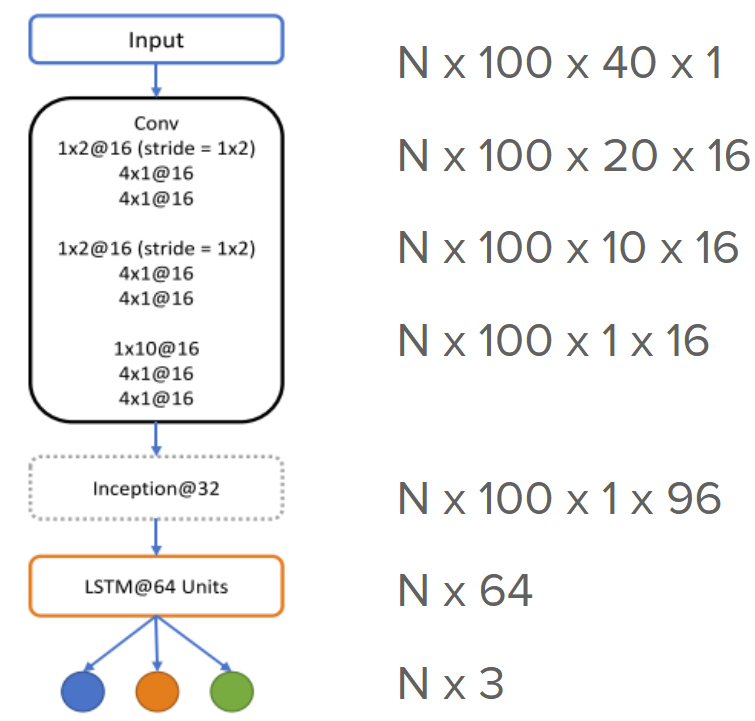
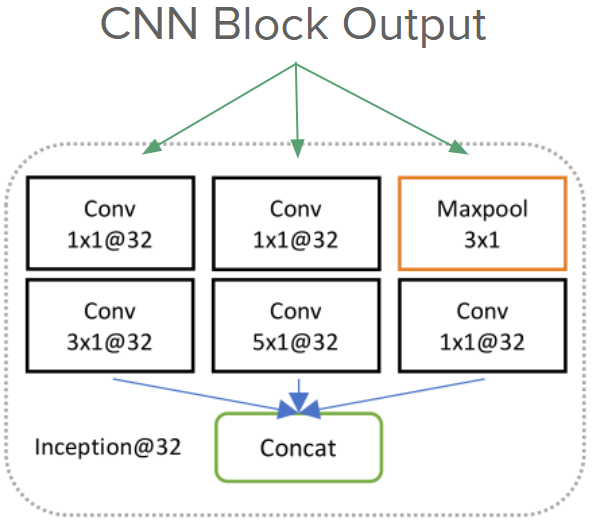

## DeepLOB-Model-Implementation-Project

Welcome to my project page! It's time to dive Deep.

This is a replicate project to develop the model raised up in the paper DeepLOB - Deep Convolutional Neural Networks. 
The original paper's authors are Zihao Zhang, Stefan Zohren, Stephen Roberts. The paper is linked here: https://arxiv.org/pdf/1808.03668.pdf

### Project Information
#### University: Northwestern University

#### Professor: Prof. Han Liu

#### Project Member & Contact Information:
  
  * Yuxiang(Alvin) Chen   yuxiangchen2021 at u.northwestern.edu

#### GitHub Repository:
  Here is my [GitHub Repository](https://github.com/yuxiangalvin/DeepLOB-Model-Implementation-Project)
  This repo contains some codes and outputs of my implementation of DeepLOB model.
  
### Motivation:

Deep Learning's application in Finance has always been one of the most complicated research area for Deep Learning. While reading various papers that focus on Deep Learning methods on Quantitative Finance applications, this paper about [DeepLOB - Deep Convolutional Neural Networks](https://arxiv.org/pdf/1808.03668.pdf) catches my attention.

Nowadays, most companies in Quantitative Finance field uses limit orderbook data to conduct all kinds of analysis. It provides much more information than traditional one point data. High frequency limit orderbook data is essential for companies which conduct high frequency trading and the importance has been growing at an extremely fast speed. As an individal who is very passionate about machine learning's applications in finance data of Level II or above, I would like to fully understand the DeepLOB model and the authors' intensions behind each design component. At the same time, I would like to further enhance my deep learning application skills. Thus, I conducted this replicate project.


### Model Details

The model takes in the limit orderbook data of one specific stock as input and conduct a 3-class prediction for the stock's mid-price movement. The three classes are 'Down', 'Hold' and 'Up'. There has been previous researches which focus on limit orderbook data. However, most of them applied static feature extract method that mainly based on domain expertise and conventions. These static methods include Linear Discriminant Analysis (LDA) and Principal Component Analysis (PCA), etc. 

The DeepLOB model intead applies a dynamic feature ectraction approach through applying Deep Learning architecture (CNN + Inception Module). It also uses an additional LSTM to capture additional dependence that is not captured by the CNN + Inception Module.

#### Inputs

##### Raw Data
The DeepLOB model takes limit orderbook data as inputs, specifically, at each time point, it takes in a limit orderbook snippet - the lowest 10 ask levels and the highest 10 bid levels. Each level has one price data and one size data. Thus, at each time point, there are 40 numbers. Below is am example of how the orderbook looks like at one time point (10 levels are shown here in this example)


The authors of the model use a lookback period of 100 timesteps at each time step. Thus at each time step, the input matrix has a dimension of 100 x 40.

Thus the input size of the model is N x 100 x 40 x 1 (N is the number of timesteps used as input)

The paper authors used two different datasets: FI-2010 and London Stock Exchange (LSE) limit orderbook data.

##### FI-2010 dataset

* FI-2010 is a public benchmark dataset of HFT LOB data and extracted time series data for five stocks from the Nasdaq Nordic stock market for a time period of 10 consecutive days. 
* The timestep distance between two data points are in average < 1 second. 
* The dataset is pre-normalized using z-score normalization.

##### LSE dataset

* LSE dataset is not a publicly accessible dataset. 
* The stocks involved has much higher liqudity than the 5 stocks in FI-2010 dataset
* The timestep distance between two data points are samller and in average 0.192 seocnd
* The dataset is not pre-normalized.

##### Data Labeling
Following quantities are calculated using corresponding equations & labels are generated.

|  Dataset  | mid-price | previous k timesteps avg mid-price | future k timesteps avg mid-price| move pct | label
| FI-2010 |   | - | ------- |  |  |
| LSE | ---  | - | ------- |  |  |


##### Data Normalization

* FI-2010 dataset is pre-noralized 
* LSE dataset: Each trading day's price and size at each level is normalized using the previous 5 trading days' price and size separately.


#### Model Structure

Here I will use the original pictures used in the original paper with my annotations to present the model structure.



The model starts with 1 CNN block with 3 sub parts. 

##### CNN Block Design

There are three points that worths noticing in the CNN block design.

1. The design of 1x2 filter and 1x2 stride at the beginning the 1st sub part is used to capture one important nature of the input data. One of the dimentions of the input data is 40 (price and size at 20 levels of order book). Since the data is ordered as price, size alternatively. This design keeps the first element of the horizontal filter only looking at prices and the second element of the filter only looking at sizes. This design takes the nature of the data into account and thus makes the 16 different feature maps generated from 16 different filters more representative.

2. The design of 4x1 filter in the 2nd layer of 1st subpart capture local interactions amongst data over four time steps.

3. The further layers keep exploring boarder interactions.

##### Inception Module

Following the CNN block is an Inception Module. The Inception Module is more powerful than a common CNN block becasue it allows to use multiple types of filter size, instead of being restricted to a single filter size. The specific structure of the Inception Module is shown below in the figure.



As the structure figure shows, this specific Inception Module contains three parallel processes. This allows the module to capture dynamic behaviors over multiple timescales. An 1 x 1 Conv layer is used in every path. This idea is form the Network-in-Network approach proposed in a [2014 paper](https://arxiv.org/pdf/1312.4400v3.pdf). Instead of applying a simple convolution to the data, the Network-in-Network method uses a small neural network to capture the non-linear properties of the data.

##### LSTM & FC

A LSTM layer with 64 LSTM unities is used after the CNN + Inception Module part in order to capture additioanl time dependencies.

A fully connected layer is used to map the 64 outputs from LSTM units to size 3 (one hot encoding of the 3 categories)


### My Replicate Codes

#### Import Libraries
```python
import pandas as pd
import numpy as np

from sklearn.model_selection import train_test_split

from keras.utils import np_utils
from keras.models import Model
from keras.optimizers import Adam
from keras.layers import Input, Conv2D, LeakyReLU, MaxPooling2D, concatenate, LSTM, Reshape, Dense
from keras.callbacks import EarlyStopping

import pandas_market_calendars as mcal
```

#### Hyper-parameters
```python
#Input param
lookback_timestep = 100
feature_num = 40

#Conv param
conv_filter_num = 16

#Inception module param
inception_num = 32

#LSTM param
LSTM_num = 64

#Activation param
leaky_relu_alpha = 0.01

#Training params
loss = 'categorical_crossentropy'
learning_rate = 0.01
adam_epsilon = 1
optimizer = Adam(lr=learning_rate, epsilon=1)
batch_size = 32

#Training stopping Criteria
metrics = ['accuracy']
#stop training when validation accuracy does not improve for 20 epochs
stop_epoch_num = 20

#max epoch num is not specified in paper, use an arbitrary large number 10000
num_epoch = 10000
```

#### Data Normalization & Labeling

I conducted experiment on two different datasets: FI-2010 & JNJ (Johnson & Johnson) 2020 January limit orderbook dataset.

##### FI-2010
* Benchmark dataset of HFT LOB data
* Extracted time series data for five stocks from the Nasdaq Nordic stock market (not very liquid asset)
* Timestep distance in average < 1 second
* Pre-normalized using z-score
* Labelled by paper authors

The dataset is included in the github repo. 

Since this dataset accessed from authors' provided source is pre-normalized & labelled so no normalization or labelling is needed and the only preprocessing is dimension adjustion.

```python
def extract_x_y_data(data, timestamp_per_sample):
    data_x = np.array(data[:40, :].T)
    data_y = np.array(data[-5:, :].T)
    [N, P_x] = data_x.shape
    P_y = data_y.shape[1]
    
    x = np.zeros([(N-timestamp_per_sample+1), timestamp_per_sample, P_x])
    
    for i in range(N-timestamp_per_sample+1):
        x[i] = data_x[i:(i+timestamp_per_sample), :]
        
    x = x.reshape(x.shape + (1,))
        
    y = data_y[(timestamp_per_sample-1):]
    y = y[:,3] - 1
    y = np_utils.to_categorical(y, 3)
    
    return x, y

train_fi_x, train_fi_y = extract_x_y_data(train_fi, timestamp_per_sample=100)
test_fi_x, test_fi_y = extract_x_y_data(test_fi, timestamp_per_sample=100)
# use a subset of the data for experiment
train_fi_x3, train_fi_y3, test_fi_x3, test_fi_y3 = train_fi_x[:100000,:,:,:], train_fi_y[:100000,:], test_fi_x[:20000,:], test_fi_y[:20000,:]
```

##### JNJ LOB
* About 160000-200000 data points per trading day
* Timestep distance in average about 0.15 second
* Not pre-normalized
* Unlabelled

This dataset is restricted to class use so it's not included in github repo.

Here I will present my complete code example of data pre-processing (normalization, labelling & dimension adjustion)

```python
# get all trading days in the date range
nyse = mcal.get_calendar('NYSE')
dates = list(nyse.schedule(start_date='2020-01-01', end_date='2020-01-09').index)
dates_str_list = []
for trading_day in dates:
    dates_str_list.append(str(trading_day.date()))

# read & store daily LOB data in a dictionary
daily_data_dict= {}
for i in range(len(dates_str_list)):
    date = dates_str_list[i]
    if date not in daily_data_dict.keys():
        date = dates_str_list[i]
        daily_data_dict[date] = np.array(pd.read_csv('./data/JNJ_orderbook/JNJ_' + date + '_34200000_57600000_orderbook_10.csv',header = None))

# get the previous 5 day mean & standard deviation for each trading day and store in dictionaries.
normalization_mean_dict = {}
normalization_stddev_dict = {}
for i in range(5,len(dates_str_list)):
    date = dates_str_list[i]
    
    if (date not in normalization_mean_dict.keys()) or (date not in normalization_stddev_dict.keys()):
        look_back_dates_list = dates_str_list[(i-5):i]
        prev_5_day_orderbook_np = None
        for look_back_date in look_back_dates_list:
            if prev_5_day_orderbook_np is None:
                prev_5_day_orderbook_np = daily_data_dict[look_back_date]
            else:
                prev_5_day_orderbook_np = np.vstack((prev_5_day_orderbook_np, daily_data_dict[look_back_date]))
                
        
        price_mean = prev_5_day_orderbook_np[:,range(0,prev_5_day_orderbook_np.shape[1],2)].mean()
        price_std = prev_5_day_orderbook_np[:,range(0,prev_5_day_orderbook_np.shape[1],2)].std()
        size_mean = prev_5_day_orderbook_np[:,range(1,prev_5_day_orderbook_np.shape[1],2)].mean()
        size_std = prev_5_day_orderbook_np[:,range(1,prev_5_day_orderbook_np.shape[1],2)].std()
        
        normalization_mean_dict[date] = np.repeat([[price_mean,size_mean]], 20, axis=0).flatten()
        normalization_stddev_dict[date] = np.repeat([[price_std,size_std]], 20, axis=0).flatten()
        
# normalize each day's data separatly
daily_norm_data_dict = {}
for i in range(5,len(dates_str_list)):
    date = dates_str_list[i]
    if date not in daily_norm_data_dict.keys():
        daily_norm_data_dict[date] = (daily_data_dict[date] - normalization_mean_dict[date])/ normalization_stddev_dict[date]
        
# define functions to generate X and y
def moving_average(x, k):
    return np.convolve(x, np.ones(k), 'valid') / k
    
def generate_labels(k, alpha, daily_data_dict):
    daily_label_dict = {}
    for date in list(daily_data_dict.keys())[5:]:
        price_ask = daily_data_dict[date][:,0]
        size_ask = daily_data_dict[date][:,1]
        price_bid = daily_data_dict[date][:,2]
        size_bid = daily_data_dict[date][:,3]
        mid_price = (price_ask * size_bid + price_bid * size_ask) / (size_ask + size_bid)
        future_k_avg_mid_price = moving_average(mid_price, k)[1:]
        change_pct = (future_k_avg_mid_price - mid_price[:-k])/mid_price[:-k]
        y_label = (-(change_pct < -alpha).astype(int))  + (change_pct > alpha).astype(int)
        
        daily_label_dict[date] = y_label.reshape(-1,1)
    return daily_label_dict

def generate_X_y(k, alpha, timestamp_per_sample, daily_norm_data_dict, daily_data_dict):
    #k is the number of future timesteps used to generate the label y
    data_x = None
    for date in daily_norm_data_dict.keys():
        if data_x is None:
            data_x = daily_norm_data_dict[date].copy()[:-k,:]
        else:
            data_x = np.vstack((data_x, daily_norm_data_dict[date][:-k,:]))
    print(data_x.shape)
    
    daily_label_dict = generate_labels(k, alpha, daily_data_dict)
    data_y = None
    for date in daily_label_dict.keys():
        if data_y is None:
            data_y = daily_label_dict[date].copy()
        else:
            data_y = np.vstack((data_y, daily_label_dict[date]))
            
    [N, P_x] = data_x.shape   
    x = np.zeros([(N-timestamp_per_sample+1), timestamp_per_sample, P_x])
    
    for i in range(N-timestamp_per_sample+1):
        x[i] = data_x[i:(i+timestamp_per_sample), :]
        
    x = x.reshape(x.shape + (1,))
    y = data_y[(timestamp_per_sample-1):]
    y = np_utils.to_categorical(y, 3)
    
    return x, y
    
# generate X and y with k = 8 & alpha = 7e-6 (alpha decided through finding the threshold value that approximately separates data into 3 balanced label categories for the specific k value)
X,y = generate_X_y(k=8, alpha=7e-6, timestamp_per_sample=100,
                   daily_norm_data_dict= daily_norm_data_dict, 
                   daily_data_dict = daily_data_dict)
# separate into train & validation data (4:1)
X_train, X_test, y_train, y_test = train_test_split(X,y,test_size = 0.2)
```

#### Model Definition

```python
def initiate_DeepLOB_model(lookback_timestep, feature_num, conv_filter_num, inception_num, LSTM_num, leaky_relu_alpha,
                          loss, optimizer, metrics):
    
    input_tensor = Input(shape=(lookback_timestep, feature_num, 1))
    
    # Conv block1
    print(input_tensor.shape)
    conv_layer1 = Conv2D(conv_filter_num, (1,2), strides=(1, 2))(input_tensor)
    print(conv_layer1.shape)
    conv_layer1 =LeakyReLU(alpha=leaky_relu_alpha)(conv_layer1)
    print(conv_layer1.shape)
    conv_layer1 = Conv2D(conv_filter_num, (4,1), padding='same')(conv_layer1)
    conv_first1 = LeakyReLU(alpha=leaky_relu_alpha)(conv_layer1)
    print(conv_layer1.shape)
    conv_layer1 = Conv2D(conv_filter_num, (4,1), padding='same')(conv_layer1)
    conv_layer1 = LeakyReLU(alpha=leaky_relu_alpha)(conv_layer1)
    print(conv_layer1.shape)

    # Conv block2
    conv_layer2 = Conv2D(conv_filter_num, (1,2), strides=(1, 2))(conv_layer1)
    conv_layer2 = LeakyReLU(alpha=leaky_relu_alpha)(conv_layer2)
    print(conv_layer2.shape)
    conv_layer2 = Conv2D(conv_filter_num, (4,1), padding='same')(conv_layer2)
    conv_layer2 = LeakyReLU(alpha=leaky_relu_alpha)(conv_layer2)
    print(conv_layer2.shape)
    conv_layer2 = Conv2D(conv_filter_num, (4,1), padding='same')(conv_layer2)
    conv_layer2 = LeakyReLU(alpha=leaky_relu_alpha)(conv_layer2)
    print(conv_layer2.shape)

    # Conv block3
    conv_layer3 = Conv2D(conv_filter_num, (1,10))(conv_layer2)
    conv_layer3 = LeakyReLU(alpha=leaky_relu_alpha)(conv_layer3)
    print(conv_layer3.shape)
    conv_layer3 = Conv2D(conv_filter_num, (4,1), padding='same')(conv_layer3)
    conv_layer3 = LeakyReLU(alpha=leaky_relu_alpha)(conv_layer3)
    print(conv_layer3.shape)
    conv_layer3 = Conv2D(conv_filter_num, (4,1), padding='same')(conv_layer3)
    conv_layer3 = LeakyReLU(alpha=leaky_relu_alpha)(conv_layer3)
    print(conv_layer3.shape)
    
    # Inception module
    inception_module1 = Conv2D(inception_num, (1,1), padding='same')(conv_layer3)
    inception_module1 = LeakyReLU(alpha=leaky_relu_alpha)(inception_module1)
    print(inception_module1.shape)
    inception_module1 = Conv2D(inception_num, (3,1), padding='same')(inception_module1)
    inception_module1 = LeakyReLU(alpha=leaky_relu_alpha)(inception_module1)
    print(inception_module1.shape)

    inception_module2 = Conv2D(inception_num, (1,1), padding='same')(conv_layer3)
    inception_module2 = LeakyReLU(alpha=leaky_relu_alpha)(inception_module2)
    print(inception_module2.shape)
    inception_module2 = Conv2D(inception_num, (5,1), padding='same')(inception_module2)
    inception_module2 = LeakyReLU(alpha=leaky_relu_alpha)(inception_module2)
    print(inception_module2.shape)

    inception_module3 = MaxPooling2D((3,1), strides=(1,1), padding='same')(conv_layer3)
    print(inception_module3.shape)
    inception_module3 = Conv2D(inception_num, (1,1), padding='same')(inception_module3)
    print(inception_module3.shape)
    inception_module3 = LeakyReLU(alpha=leaky_relu_alpha)(inception_module3)
    print(inception_module3.shape)
    
    inception_module_final = concatenate([inception_module1, inception_module2, inception_module3], axis=3)
    print(inception_module_final.shape)
    inception_module_final = Reshape((inception_module_final.shape[1], inception_module_final.shape[3]))(inception_module_final)
    print(inception_module_final.shape)

    # LSTM
    LSTM_output = LSTM(LSTM_num)(inception_module_final)
    print(LSTM_output.shape)

    # Fully Connected Layer with softmax activation function for output
    model_output = Dense(3, activation='softmax')(LSTM_output)
    print(model_output.shape)
    
    DeepLOB_model = Model(inputs=input_tensor, outputs= model_output)  
    es = EarlyStopping(monitor='val_accuracy', mode='max', verbose=1)
    
    DeepLOB_model.compile(optimizer=optimizer, loss=loss, metrics=metrics)

    return DeepLOB_model
```

#### Model Initiation & Training

```python
DeepLOB_model = initiate_DeepLOB_model(lookback_timestep, feature_num, conv_filter_num, inception_num, LSTM_num, leaky_relu_alpha,
                          loss, optimizer, metrics)

# definte the training stop criteria (no new max validation accuracy in 20 consecutive epochs)
es = EarlyStopping(monitor='val_accuracy', mode='max', patience = stop_epoch_num, verbose=1)
DeepLOB_model.fit(X_train, y_train, epochs=num_epoch, batch_size=batch_size, verbose=2, validation_data=(X_test, y_test), callbacks = [es])
```

### Results & Next Steps
Performance Metrics Comparison Table

|    | MAPE | R | Theil U |
| -- | ---  | - | ------- |
| RNN*  | 0.018  | 0.847 | 0.847|
| WSAEs-LSTM*  | 0.011  | 0.946 | 0.007
| LSTM Encoder Decoder             | 0.011  | 0.872 | 0.008 |
| LSTM Encoder Decoder + Attention | 0.0075  | 0.947 | 0.005 |
| Transformer                      | 0.0055  | 0.980 | 0.0038 |

The first two models are models from our referenced paper [A deep learning framework for financial time series using stacked autoencoders and long-short term memory](https://www.researchgate.net/publication/318991900_A_deep_learning_framework_for_financial_time_series_using_stacked_autoencoders_and_long-short_term_memory)

Daily Close Price Predictions Comparison Graph


The three performance metrics and the graph match with each other and we conclude  that  among  the  three  models,  transformer model performs the best in predicting S&P500 index daily movement in our experiment setting. Although this result does not indicate transformer will always perform the best in any financial  time-series  prediction  tasks  (eg.   different  data  freqeuncy, input variables), it indicates that transformer has a high potential to be applied in financial time-series prediction tasks and should be payed more attention to in future researches on financial time series. We also plan to see whether this conclusion hold for other financial products and possibly further develop our Transformer model to generate daily adjusted investment strategy.
